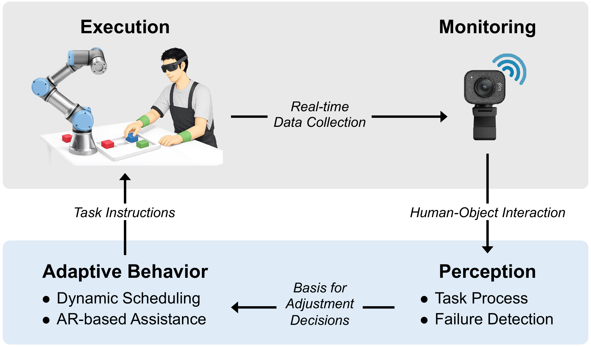
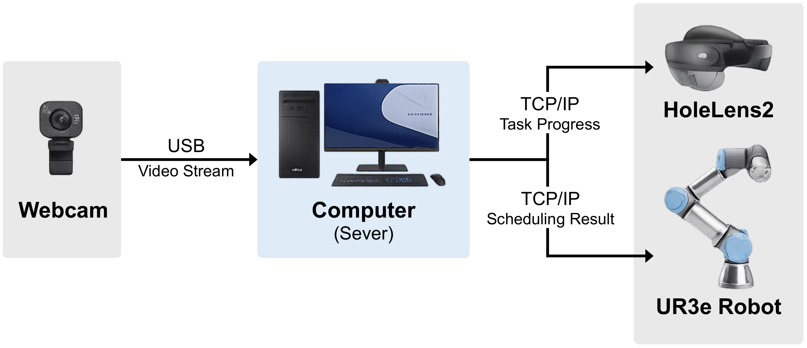

# HRC Real-Time Dynamic Task Allocation

本專案為碩士研究 **「考量人員作業行為之人機協作即時動態工作分配機制」**\
（*Real-Time Dynamic Task Allocation in Human-Robot Collaboration Considering Human Task Action*）之程式與實驗系統。

研究以人機協作配套裝箱（Kitting）作業為驗證情境，整合作業狀態感知、失效事件判定、動態任務分配、AR 輔助資訊與協作型機械手臂控制，使系統能依據人員實際作業狀態，在作業流程偏離原先排程時進行對應調整。

---

# 1. Project Overview

本系統主要處理人機協作作業中，人員實際行為與原先排程不一致的情況。

整體系統由四個模組形成持續循環的閉環架構：

```text
Execution 作業執行
        ↓
Monitoring 作業監控
        ↓
Perception 作業狀態感知
        ↓
Adaptation 適應性調整
        ↓
Execution 作業執行
```


系統於作業期間持續掌握：

- 人員與物件的互動狀態
- 任務執行進度
- 任務開始與完成狀態
- 作業延遲
- 任務順序偏離
- 其他失效事件

當人員行為造成原先排程假設不再成立時，系統依失效類型決定：

1. 不進行介入
2. 透過 AR 提醒人員自行修正
3. 接受目前已形成的作業狀態，重新安排後續人機任務

除正式實驗系統外，本專案也包含離線模擬、VNS 演算法效能測試、HOI 分析以及早期開發程式。

---

# 2. System Architecture

本專案主要可分為三個部分：

```text
HRC Real-Time Dynamic Task Allocation
│
├── A. Real-Time Experimental System
│      真實人機協作實驗系統
│
├── B. Offline Simulation System
│      離線模擬與 benchmark 建立
│
└── C. Verification / Analysis Tools
       排程驗證、VNS 測試與感知分析
```

正式實驗與離線模擬皆採用 **Variable Neighborhood Search（VNS）** 作為動態排程演算法，兩者的搜尋與排程邏輯相同。然而，由於正式實驗與離線模擬取得作業狀態資訊的方式，以及提供給排程器的輸入內容不同，因此分別建立對應的 Solver，以配合兩種系統的資料結構與執行流程。

---

# 3. Repository Structure

## 3.1 Real-Time Experimental System

正式人機協作實驗主要使用：

```text
HRC_schedule_perception_main.py
│
├── read_schedule.py
├── precedence_matrix.py
│
├── HOI.py
│   └── hand_curled.py
│
├── HRC_perception_solver_bridge.py
│   └── VNS_dynamic_solver.py
│
├── Robot Control/
│   └── UR_task_control_server.py
│
└── Unity / HoloLens
```

### `HRC_schedule_perception_main.py`

**正式實驗的核心主程式。**

主要負責：

- 攝影機畫面取得
- 人員與物件狀態監控
- 任務進度更新
- HOI 判定
- 失效事件偵測
- 人員與 Robot 任務狀態管理
- 動態重新排程觸發
- Unity / HoloLens 資訊更新
- Robot 任務資訊傳遞
- 實驗與失效紀錄輸出

正式實驗開始前，應先完成 Robot 與 HoloLens / Unity 端的準備，再啟動此程式。

---

### `HRC_perception_solver_bridge.py`

**作業狀態感知與正式動態排程之間的橋接程式。**

主要將失效發生當下的資訊整理成動態排程所需的輸入，例如：

- 失效決策時間點
- 已完成任務
- 執行中任務
- 尚未開始任務
- 人員與機械手臂當前可用時間
- 目前排程狀態

再將上述資訊提供給正式實驗使用的動態 Solver。

---

### `VNS_dynamic_solver.py`

**正式實驗使用的動態排程 Solver。**

當系統偵測到需由系統進行補償的失效事件後，依失效當下的真實作業狀態重新規劃後續任務。

重新排程當下：

- 已完成任務保留實際執行結果
- 執行中任務不進行中斷或重新分配
- 尚未開始任務才納入重新排程
- 重新考量代理人可用時間
- 保留任務相依關係與實體作業限制
- 以整體作業總完成時間為主要排程目標

---

### `HOI.py`

**正式實驗使用的人員－物件互動（Human-Object Interaction, HOI）判定模組。**

主要依據：

- 手部位置
- 手部抓取姿態
- 物件類別與位置
- 手部與物件間的相對距離

判定人員目前正在操作的物件。

---

### `hand_curled.py`

**提供手部抓取姿態相關判定功能，供正式 HOI 模組使用。**

---

### `Robot Control/UR_task_control_server.py`

**正式實驗使用的 UR3e 控制程式。**

功能包含：

- 接收主系統傳送之 Robot 任務
- 控制 UR3e 執行對應取放流程
- 控制末端夾爪
- 回傳任務執行狀態

正式實驗時須先啟動此程式，再啟動：

```text
HRC_schedule_perception_main.py
```

成功連線後，UR3e TCP 會回到初始位置，夾爪亦會進行開關測試，可藉此確認 Robot 控制與通訊是否正常。

---

## 3.2 Offline Simulation System

離線模擬主要分為兩類：

```text
Offline Simulation
│
├── 1. 完全離線模擬（手動輸入失效資訊）
│      └── failure_simulation.py
│
└── 2. 使用正式實驗資料建立 benchmark
       ├── real_data_nores_simulation.py
       └── batch_nores_sim_runner.py
```

離線模擬使用的solver：

```text
simulation_solver.py
```

---

### `simulation_solver.py`

**離線模擬系統使用的排程 Solver。**

主要服務於模擬器，依模擬條件重新規劃排程與作業流程。

---

### `failure_simulation.py`

**完全離線的失效模擬器。**

主要特性：

- 失效資訊由使用者手動設定
- 使用標準工時參數
- 不需要真實正式實驗資料
- 可模擬指定失效發生後的流程變化
- 可比較：
  - 失效後重新排程
  - 失效後不重新排程

適合用於：

- 特定失效案例測試
- 排程行為觀察
- 動態排程邏輯確認
- 不同失效條件下的結果比較

---

### `real_data_nores_simulation.py`

**利用正式實驗所產生的真實作業資料，重建 benchmark 條件下「失效發生後不重新排程」的作業流程，一次處理一筆實驗資料。**

正式實驗是在具動態重新排程功能的系統下進行，因此會留下真實：

- 任務執行狀態
- 作業時間
- 失效事件
- 排程變化
- 其他作業紀錄

此程式利用上述資料，在相同實際作業條件下模擬：

> 若失效發生後不進行動態重新排程，作業流程將如何發展。

---

### `batch_nores_sim_runner.py`

**用途與 ****`real_data_nores_simulation.py`**** 相同，但可一次對多筆正式實驗資料進行批次模擬。**

### Offline Simulation Programs Comparison

| Program                         | Input         | Purpose                      | Mode |
| ------------------------------- | ------------- | ---------------------------- | ---- |
| `failure_simulation.py`         | 手動設定失效 + 標準工時 | 完全離線比較重新排程 / 不重新排程           | 單一案例 |
| `real_data_nores_simulation.py` | 正式實驗真實資料      | 建立 no-rescheduling benchmark | 單筆   |
| `batch_nores_sim_runner.py`     | 正式實驗真實資料      | 建立 no-rescheduling benchmark | 批次   |

### Simulation Usage

`real_data_nores_simulation.py` 用於單筆資料模擬，`batch_nores_sim_runner.py` 則用於批次處理 `data/` 中已整理的正式實驗資料。以下指令中的輸出資料夾名稱為目前使用範例。

#### Dry Run

正式批次模擬前，可先使用 dry-run 模式確認批次輸入與執行設定：

```bash
python batch_nores_sim_runner.py --input-dir data --simulator real_data_nores_simulation.py --failure-module failure_simulation.py --dry-run
```

參數說明：

- `--input-dir data`：指定批次模擬的輸入資料夾，目前使用 `data/` 中已整理的正式實驗資料。
- `--simulator real_data_nores_simulation.py`：指定批次執行時使用的單筆模擬程式。
- `--failure-module failure_simulation.py`：指定模擬時使用的失效處理模組。
- `--dry-run`：先檢查批次輸入與預計執行內容，不進行正式模擬。

#### Standard Human Time + Fixed Compensation

人員工時使用標準工時，延遲補償參數採固定值。

**批次執行：**

```bash
python batch_nores_sim_runner.py --input-dir data --output-dir batch_nores_outputs_standard --simulator real_data_nores_simulation.py --failure-module failure_simulation.py --human-time-mode standard --compensation-mode fixed --compensation-value 3.39
```

**單筆執行：**

```bash
python real_data_nores_simulation.py --events dynamic_events_20260618_155540.csv --gantt gantt_data_20260618_155540.txt --output-dir nores_output_standard --failure-module failure_simulation.py --human-time-mode standard --compensation-mode fixed --compensation-value 3.35
```

主要參數說明：

- `--events`：指定單筆正式實驗的失效事件 CSV。
- `--gantt`：指定與該筆實驗對應的甘特圖 raw data。
- `--output-dir`：指定模擬結果輸出資料夾；可依需求修改。
- `--human-time-mode standard`：模擬時使用人員標準工時。
- `--compensation-mode fixed`：延遲補償參數使用固定值。
- `--compensation-value`：指定固定的延遲補償參數數值。

批次標準工時模擬結果目前統一輸出至 `batch_nores_outputs_standard/`。

#### Real Human Time + Random Compensation

人員工時使用正式實驗的實際數據，延遲補償參數採隨機模式。

**批次執行：**

```bash
python batch_nores_sim_runner.py --input-dir data --output-dir batch_nores_outputs_real --simulator real_data_nores_simulation.py --failure-module failure_simulation.py --human-time-mode real --compensation-mode random --seed 43
```

**單筆執行：**

```bash
python real_data_nores_simulation.py --events dynamic_events_20260618_155540.csv --gantt gantt_data_20260618_155540.txt --output-dir nores_output_human_real --failure-module failure_simulation.py --human-time-mode real --compensation-mode random --seed 43
```

主要參數說明：

- `--human-time-mode real`：模擬時使用正式實驗記錄的人員實際工時。
- `--compensation-mode random`：延遲補償參數採隨機方式產生。
- `--seed 43`：設定隨機種子，使相同設定下的隨機結果可重現。

批次真實工時模擬結果目前統一輸出至 `batch_nores_outputs_real/`。

#### Human-Robot Idle Time Analysis

目前僅針對真實工時模擬結果進行人機資源利用率分析，因此 `idle_time_analyzer.py` 放置於 `batch_nores_outputs_real/` 中。在該資料夾執行：

```bash
python idle_time_analyzer.py --input-dir .
```

程式會搜尋其下各案例資料夾中的 `comparison_gantt_data.txt`，計算 No Rescheduling 與 Dynamic 條件下的人員與機械手臂閒置時間比例，並於目前資料夾輸出 `idle_time_ratio_summary.csv`。

---

# 4. Scheduling Configuration

## 4.1 Schedule Files

專案中目前主要使用三種 schedule：

| File                     | Purpose                 |
| ------------------------ | ----------------------- |
| `schedule.csv`           | **正式實驗使用**的任務與工時設定      |
| `schedule_no_buffer.csv` | 未納入感知系統辨識時間之工時參數版本      |
| `schedule_random.csv`    | 隨機生成任務工時，主要用於 VNS 演算法測試 |

### `schedule.csv`

**正式實驗使用的 schedule。**

---

### `schedule_no_buffer.csv`

**使用未考慮感知系統辨識時間之工時參數。**

用於不同工時設定下之研究、比較或測試。

---

### `schedule_random.csv`

**任務工時採隨機方式產生，用於建立較多樣的排程條件**。

確認 VNS 在不同或較複雜的工時組合下仍具有：

- 排程品質改善能力
- 穩定的求解表現
- 足以支援即時需求的收斂速度

---

## 4.2 `read_schedule.py`

**負責讀取目前使用的排程內容。**

主要會被：

- 正式實驗系統
- `failure_simulation.py`

使用。

切換正式實驗或測試條件前，務必先確認此程式目前指定的 schedule 檔案。

---

## 4.3 `precedence_matrix.py`

**負責建立排程使用的任務相依關係矩陣（Precedence Matrix）。**

此矩陣描述不同任務之間的先後與相依限制，供 VNS Solver 判斷候選排程是否符合任務結構。

只要使用 VNS Solver 的排程流程，都會使用此任務關係資訊。

---

# 5. Solver Roles

專案中有多個名稱包含 Solver / Rescheduler 的程式，其演算法基礎皆為 VNS，但依不同系統的資訊輸入方式與使用目的分別實作。

| Program                 | Main Purpose                                      |
| ----------------------- | ------------------------------------------------- |
| `VNS_dynamic_solver.py` | 正式實驗失效後的即時動態重新排程                                  |
| `simulation_solver.py`  | 離線模擬系統使用                                          |
| `VNS_rescheduler.py`    | `VNS_verification.py` 與 `VNS_test.py` 使用的 VNS 求解器 |

---

## 5.1 `VNS_rescheduler.py`

此 Solver 主要供：

```text
VNS_verification.py
VNS_test.py
```

使用。

主要用途：

- 最佳排程計算
- VNS 求解品質測試
- 收斂與效能分析

---

# 6. Scheduling Cases

排程模型中設計 Case 1、Case 2、Case 3，用來描述不同程度的 Kit 間與 Robot 任務銜接條件。

> **目前正式研究情境採用 Case 3，因此專案中的排程相關參數皆以 Case 3 作為預設設定。除非針對 Case 1 或 Case 2 進行特定比較或測試，否則請勿任意修改 Case 相關參數，以避免排程邏輯與正式實驗情境不一致。**

## Case 1

**各 Kit 可視為相互獨立的作業區段。**

特性：

- Kit Box 更換完成後，該 Kit 的 Pick & Place 才開始
- 不同 Kit 之間不提前銜接
- 作業限制最嚴格
- 排程彈性最低

---

## Case 2

允許同一 Kit 中，Robot 在 Kit Box 尚未完成更換時提前進行部分 Pick & Place 流程。

Robot 可先進行 Pick 與 Move，但最終 Place 仍必須等待對應 Kit Box 更換完成。

Case 2 增加 Kit 內部的人機作業重疊，但不同 Kit 之間仍未完全串接。

---

## Case 3

正式研究主要採用的作業邏輯。

除了保留 Case 2 的 Robot 提前 Pick / Move 規則外，進一步允許：

> 當前一 Kit 的最後一項任務開始後，Robot 即可提前準備下一 Kit 所需的物料。

因此不同 Kit 之間可形成較連續的作業銜接。

但下一 Kit 的 Robot 最終 Place 動作仍必須等待該 Kit 的 Kit Box 更換完成。

---

## Comparison of Scheduling Cases

| Case   | Robot 可於 Replace 完成前先 Pick / Move | 下一 Kit 可提前準備 | 特性                 |
| ------ | --------------------------------: | -----------: | ------------------ |
| Case 1 |                                No |           No | Kit 間完全獨立          |
| Case 2 |                               Yes |           No | Kit 內部可重疊          |
| Case 3 |                               Yes |          Yes | Kit 內重疊 + 跨 Kit 串接 |

---

# 7. VNS Verification & Performance Evaluation

## 7.1 `VNS_verification.py`

**取得目前任務結構與工時條件下的最佳排程。**

目前任務結構下是利用 **Case 3** 求解方式取得當前情境下的最佳排程。

此最佳解另外曾透過**窮舉所有可行排程解**進行確認，因此可確認 Case 3 求解所得結果與當前問題條件下的最佳解一致。

---

## 7.2 `VNS_test.py`

**VNS 演算法效能測試工具。**

同樣使用：

```text
VNS_rescheduler.py
```

但目的與 `VNS_verification.py` 不同。

`VNS_test.py` 會重複執行多次 VNS 求解，通常搭配：

```text
schedule_random.csv
```

藉由隨機工時建立較多樣與較複雜的排程條件，用來評估：

- VNS 多次獨立求解結果的品質
- 收斂速度是否符合即時動態排程需求

---

## 7.3 `vns_convergence_replay_bundle`

此資料夾保存論文分析階段，驗證特定案例之 VNS 於每次重新排程的收斂性資料。

由於正式實驗執行時主要關注即時動態排程結果，並未額外保存每次 VNS 迭代過程的收斂資訊，因此於實驗完成後，利用已保存的實驗案例資料重新建立各次動態排程情境，以取得 VNS 求解過程中的收斂曲線。

主要用途為觀察每次動態重新排程時 VNS 的搜尋收斂過程。

---

# 8. Perception / HOI Analysis

## 8.1 `analysis.py`

**HOI 感知結果的主要分析程式。**

主要用來進行模型與辨識結果評估，並輸出各模型的偵測或辨識表現。

---

## 8.2 `HOI_analysis.py`

**提供 ****`analysis.py`**** 使用的 HOI 分析相關功能。**

此程式用於模型參數分析與評估，不參與正式實驗主流程。

---

## 8.3 `HAR/`

**此資料夾為研究早期的人員動作辨識方法。**

包含早期：

- 人員動作辨識
- 模型訓練
- 資料蒐集
- 測試與模型驗證

- `HOI_test/`
  - 為 HAR 方法架構下的人物互動辨識測試程式與相關資料。

目前正式系統已不直接使用此方法，因此 `HAR/` 主要保留作為早期研究開發與方法測試紀錄。

---

# 9. Real-Time Experimental System — How to Run

**說明正式實驗系統從執行前設定、設備初始化到正式作業與結果保存的完整執行流程。**

## 9.1 Communication Overview

正式系統主要包含：

- Experiment PC / Python backend
- Camera
- UR3e
- Robot gripper
- HoloLens 2 / Unity application

主程式負責將作業資訊與控制需求傳送至 Robot 與 Unity / HoloLens 端。



---

## 9.2 Configuration Before Running

正式實驗前確認以下兩項設定 (IP & schedule檔案)。

### Unity / HoloLens IP

於 `HRC_schedule_perception_main.py` 中確認 Unity / HoloLens 連線 IP。

正式實驗：

```text
使用目前 HoloLens / Unity 實際 IP
```

若僅在同一台電腦上以 Unity 進行功能測試：

```text
127.0.0.1
```

即可。

---

### Schedule

於 `read_schedule.py` 確認目前使用的 schedule。

正式實驗應使用：

```text
schedule.csv
```

演算法測試時則依測試需求切換至其他 schedule。

---

# 10. Formal Experiment Startup Procedure

## Step 1 — Camera Setup

1. 架設相機。
2. 確認拍攝位置與角度能涵蓋需辨識的作業區域。
3. 視現場光線狀況調整電腦端 Camera Settings的參數
4. 確認手部與物件於影像中皆可清楚辨識。

---

## Step 2 — UR3e and Gripper Initialization

1. 開啟 UR3e。
2. 示教器開啟 Remote Control。
3. 確認末端夾爪可正常使用。
4. 執行：

```text
Robot Control/UR_task_control_server.py
```

5. 確認程式與 Robot 連線成功。
6. 成功連線後：
   - UR3e TCP 回到初始位置
   - 夾爪執行開 / 關測試

若以上初始化動作正常，即代表 Robot 控制端可正常使用。

---

## Step 3 — HoloLens / Unity

1. HoloLens 開機。
2. 開啟實驗使用的 Unity application。

---

## Step 4 — Start Main Program

確認 Robot Control 與 HoloLens / Unity 已準備完成後，執行：

```text
HRC_schedule_perception_main.py
```

主程式開始進行系統初始化。

---

## Step 5 — HoloLens QR Code Registration

主程式初始化期間，可同步進行 HoloLens 空間定位。

1. 將指定 QR Code 放置於預先定義的 Robot 座標位置。
2. 使用 HoloLens 進行 QR Code 定位。
3. 畫面出現對應按鈕與倒數畫面後，代表定位完成。

---

## Step 6 — Camera Region Setup

主程式初始化完成並顯示 Camera Monitoring Window 後：

1. 手動選取 Kit Box 區域。
2. 依不同 Kit 配置選取物件放置位置。
3. 確認各辨識區域與實際工作區域一致。

---

## Step 7 — Start Experiment

確認 Human、Robot、Camera、HoloLens 與 Workstation 皆準備完成後，按下 `START` 正式開始人機協作流程。

---

## Step 8 — End Experiment and Save Results

當全部作業流程完成後，系統畫面會顯示 `Completed`，接著在作業監控視窗按下 `q` 結束監控。

系統將：

- 顯示各次動態重新排程的總覽圖
- 保存失效事件紀錄
- 保存每次失效發生時的作業流程甘特圖資訊
- 保存相關作業與實驗紀錄

後續 benchmark 模擬會使用這些正式實驗輸出的資料。

---

# 11. Python Environment

正式實驗電腦已建立可正常執行本系統的 Python 環境與相關套件。

若直接使用原實驗電腦：

> 建議沿用目前已安裝完成的 Python Environment。

若需於其他電腦重新建立環境：

> 建議參考原實驗電腦目前使用的 Python 與各套件版本進行安裝，以降低版本相容性或套件衝突問題。

主要涉及之 Python / Computer Vision 套件包含：

- OpenCV
- MediaPipe
- Ultralytics YOLO
- NumPy
- Pandas
- 其他程式內使用之相關套件

repository 目前不另外維護完整套件版本清單。

---

# 12. Data and Experimental Records

正式實驗完成後，系統輸出的甘特圖存放於 `dynamic_gantt_outputs/`，其餘供後續分析與模擬使用的數據檔案則存放於 `dynamic_raw_data_outputs/`。

## Experiment raw data

`Experiment raw data/` 保存每位受試者於正式實驗過程中產生的完整原始資料，包含系統輸出的甘特圖、作業數據與失效事件。

此資料夾主要用於保存實驗原始紀錄，方便後續進行個別受試者分析與資料追蹤。

## Simulation Data

`data/` 為由正式實驗輸出的資料整理後建立之模擬輸入資料。

與 `Experiment raw data/` 不同：

- `Experiment raw data/`：依受試者分類保存完整原始實驗資料。
- `data/`：將不同受試者資料整理後集中存放，主要供離線模擬程式使用。

`real_data_nores_simulation.py` 與 `batch_nores_sim_runner.py` 主要讀取 `data/` 中整理後的資料，以建立 benchmark 條件下的模擬結果。

模擬結果依使用的工時資料分別存放：

- 使用正式實驗實際工時進行模擬：`batch_nores_outputs_real/`
- 使用標準工時參數進行模擬：`batch_nores_outputs_standard/`

若需將模擬結果輸出至其他位置，可透過執行指令中的 `--output-dir` 修改。

---

# 13. Standard Time Calculation

`Standard Time Calculation/` 用於建立代理人工時參數，提供排程模型與模擬系統使用。

本資料夾主要透過**動素分析與 MTM 標準時間估算方法**，依據任務動作組成、手部移動距離與操作位置，建立不同任務條件下的人員執行時間。

## 13.1 Human Time Parameter Generation

代理人工時參數建立流程如下：

```text
各任務之動素分析
          ↓
動作距離與位置資訊建立
          ↓
MTM 標準時間查表
          ↓
計算單一任務標準時間
          ↓
建立排程使用之人員工時參數
```

### `therblig_calculation.py`

主要用於計算人員任務的標準時間。

功能包含：

- 讀取動素組成資料
- 讀取人員操作位置座標
- 計算手部移動距離
- 根據動素類型進行時間查表
- 轉換時間單位 TMU 至秒數
- 輸出各任務標準時間

計算流程：

- 移動類動作（R / M）

  - 根據起點與終點座標計算距離
  - 對應至 MTM 距離級距
  - 查詢對應時間

- 其他固定動作

  - 直接依 Therblig 類型查詢時間

### `therblig_calculation.csv`

定義各任務的動素組成。

包含：

- 任務名稱
- 動作種類
- 起點
- 終點
- 動作類型

程式會依此資料切分任務並計算各任務時間。

### `therblig_process_time.csv`

動素時間查詢表。

用於：

- 根據動素類型取得基礎時間
- 提供 MTM 時間換算依據

### `coord_for_human.csv`

人員操作位置座標資料。

用於：

- 計算手部移動距離
- 提供動素中移動動作的空間資訊

---

## 13.2 Robot Time Parameter Generation

除代理人工時外，本資料夾亦包含機械手臂任務時間量測工具，用於建立 Robot 任務時間參數。

### `UR_multi_task_time.py`

用於量測 UR3e 執行各項任務流程所需時間。

主要功能：

- 讀取機械手臂路徑點位（waypoint）
- 產生 URScript
- 控制 UR3e 執行 Pick & Place 任務
- 接收機械手臂回傳任務完成時間
- 輸出各任務實際執行時間

### Robot Time Data

相關資料：

| File | Purpose |
| --- | --- |
| `robot_task_waypoint.csv` | 機械手臂之任務移動點位設定 |
| `robot_task_time.txt` | 機械手臂執行時間紀錄 |
| `robot_task_time.csv` | 機械手臂任務時間參數 |
| `robot_time_lookuptable.py` | 將 `robot_task_time.txt` 轉換為 CSV 格式 (`robot_task_time.csv`) |
| `coord_for_robot.csv` | 操作位置座標資訊 |

---

## 13.3 Execution

人員標準時間計算：執行 `therblig_calculation.py`。

Robot 任務時間量測：執行 `UR_multi_task_time.py`。

---

# 14. Legacy / Staging

部分程式屬於早期開發、測試或已不再使用的舊系統。

## `UR_task_control_client.py`

早期 Robot 通訊架構。

目前正式實驗使用：

```text
UR_task_control_server.py
```

---

## `HAR/`

早期 HAR 方法，目前正式實驗不直接使用。

保留目的主要為：

- 研究開發紀錄
- 舊模型與方法追蹤
- 後續方法的比較或參考

---

# 15. Research Information

**Research Title**

考量人員作業行為之人機協作即時動態工作分配機制

*Real-Time Dynamic Task Allocation in Human-Robot Collaboration Considering Human Task Action*

**Application Scenario**

Human-Robot Collaborative Kitting

**Institution**

National Tsing Hua University\
Department of Industrial Engineering and Engineering Management
